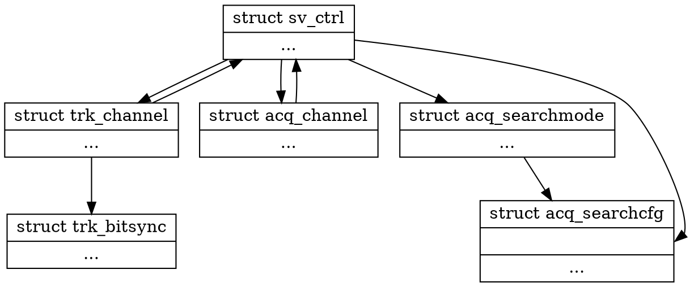

#Tracking Channel

## Structure Diagram


## Declaration
```c
struct trk_channel
{
};


void trkchan_init(unsigned chansize);
struct trk_channel *trkchan_deploy(struct sv_ctrl *svctrl);
void trkchan_kill(struct trk_channel *trkchan);

/**
 * Number of tracking channel occupied.
 */
unsigned trkchan_occupied(void);

void trkchan_gc(void);

struct trkchan_bitsync *trkchan_bitsync_alloc(void);
void trkchan_bitsync_dealloc(struct trkchan_bitsync *bitsync);


```
