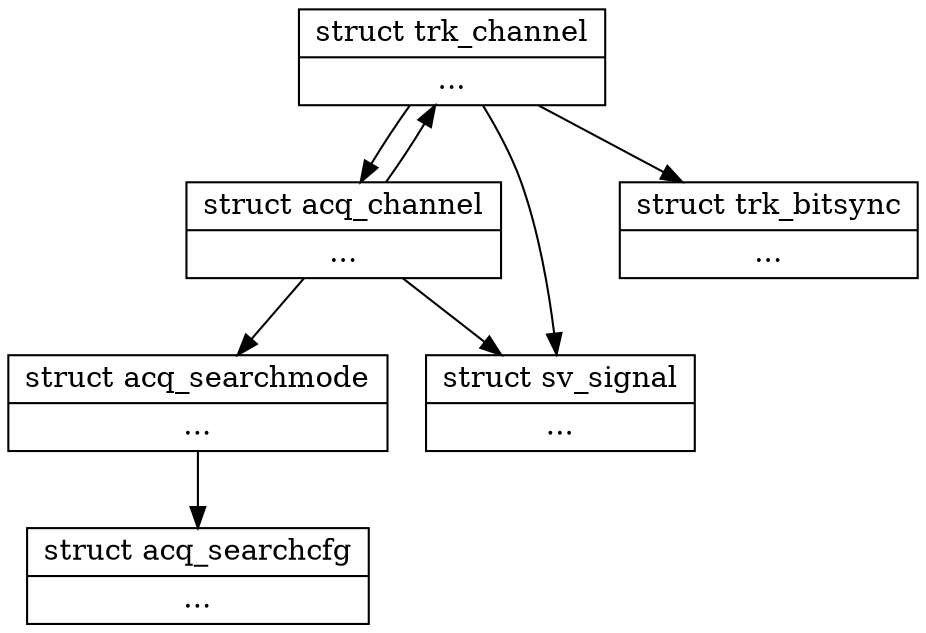

#Tracking Channel

## Structure Diagram


## Declaration
```c
struct trk_channel
{
};

struct trk_channel *trkchan_alloc(void);
void trkchan_dealloc(struct trk_channel *trk);
void trkchan_gc(void);
```
