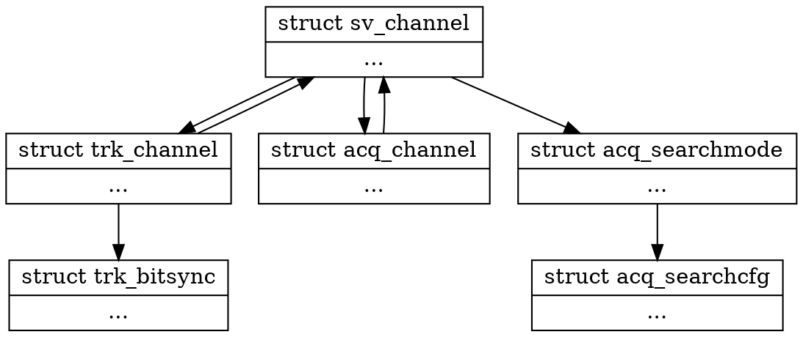

#Tracking Channel

## Structure Diagram


## Declaration
```c
struct trk_channel
{
};


struct trk_channel *trkchan_alloc(void);
void trkchan_dealloc(struct trk_channel *trkchan);
void trkchan_gc(void);

void trkchan_stop(struct trk_channel *trkchan);

```
