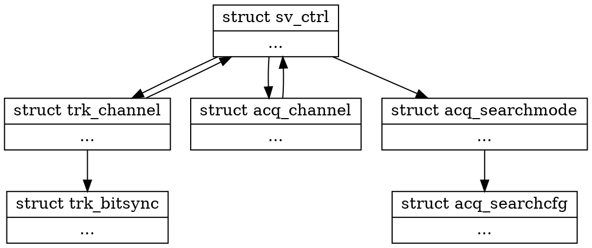

#Tracking Channel

## Structure Diagram


## Declaration
```c
struct trk_channel
{
};


void trkchan_init(unsigned chansize);
struct trk_channel *trkchan_deploy(struct sv_ctrl *svctrl);
void trkchan_kill(struct trk_channel *trkchan);

void trkchan_gc(void);


```
